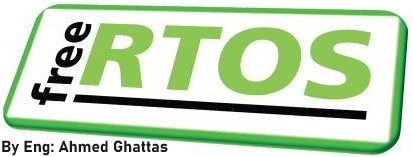

# Free RTOS Course

* I teached FreeRTOS course to students from alexandria university.
* I used proteus simulation software to explain for them FreeRTOS functionalities using AVR microcontroller.
* I attached a link to demonstrate the labs that are teahced to them in the course.
 

